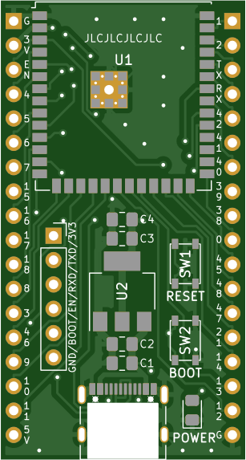
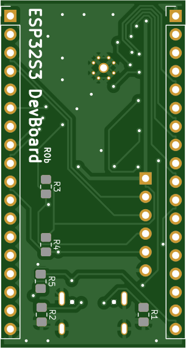
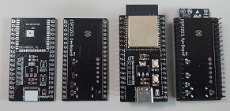

# ESP32-S3 DevBoard

## ESP32-S3なDevBoardを作ろう
- いつものようにJLCPCBへ製造を依頼
- 秋月電子にて部品を購入
- はんだ工作して完成(USB-Cコネクタは難易度が高かった)

## 部品表
|PCB #|名前|部品番号|
|:-|:-|:-|
|U1|ESP32-S3-WROOM-1-N16R8|M-17256|
|U2|レギュレーター3.3V|I-12635/※2|
|P1|USB Type-Cコネクタ|C-14356|
|SW1,SW2|タクトスイッチ|P-06185|
|C1,C4|コンデンサー10uF(1608)|P-13161|
|C2,C3|コンデンサー0.1uF(1608)|P-13374|
|D1|LED(1608)|I-03984|
|R1,R2|抵抗5.1k(1608)|※1|
|R3,R4|抵抗10k(1608)|※1|
|R5|抵抗1k(1608)|※1|
|J1,J2,J3|ピンヘッダ|C-00167|
||||

- ※1：マルツ等で購入しました
- ※2：安いこれ(I-16155)でもいけそう

## PCBイメージ

## 完成写真

